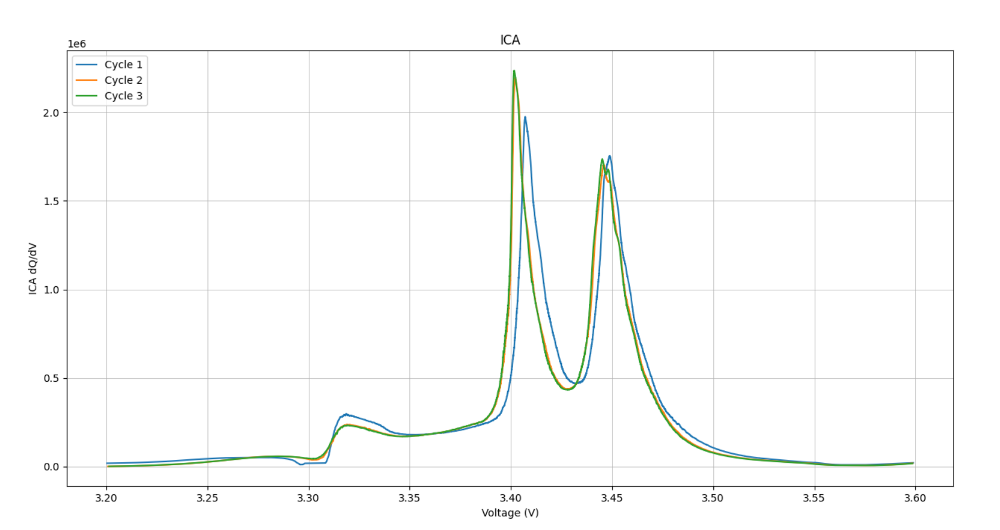

# README : BATCONNECT PROJECT
**Author :** Léa PITAULT

**Starting date :** 07/01/2021

## Table of contents :
1. [Project](#project)

## Project :
The idea of this projet is to extract, sort the data, and plot different curves of LiFePO4 batteries.
Those batteries are cycled on a test bench and the data are collected in a .txt file

## Data file format : 
.txt file with 8 columns

Sequence number | time | cycle number | Voltage (V) | Current (mA) | Charge (m.Ah) | Discharge (m.Ah) | Cell external temperature (°C)

## Files of the project : 
- Functions_PlotCurves.py : contains all the useful functions to sort the data, plot curves, compute the ICA, filter the data and curves
- Main_dataMargot : main file using Margot dataset and LiNMC battery cell
- Main_dataLea : main file using Lea dataset and LiFePO4 battery cell

## Usage :

### To plot the ICA curves :
 - F_plot.readFile(fileTitle) : you get the whole dataset as lists with the data of the 8 columns. You also get the number of cycle and sequence
 - F_plot.sortData(dic_dataSet) : you get a dictionary with the values in function of cycle or in function of sequences and charge or discharge
 - F_plot.plotICASeq(dic_dataSeq) : you plot the ICA curves after filtering

ICA curves are plotted using the **charge** values

### Minimal main example :
```python
import Functions_PlotCurves as F_plot

file_title = '20210722_Cycle50A_LiFePO4_BATCONNECT_CA1.txt'

dic_dataSet, nbCycle, nbSeq = F_plot.readFile(file_title)
dic_dataCycle, dic_dataSeq = F_plot.sortData(dic_dataSet)
F_plot.plotICASeq(dic_dataSeq)
```

### Example of result with ICA Curves :


