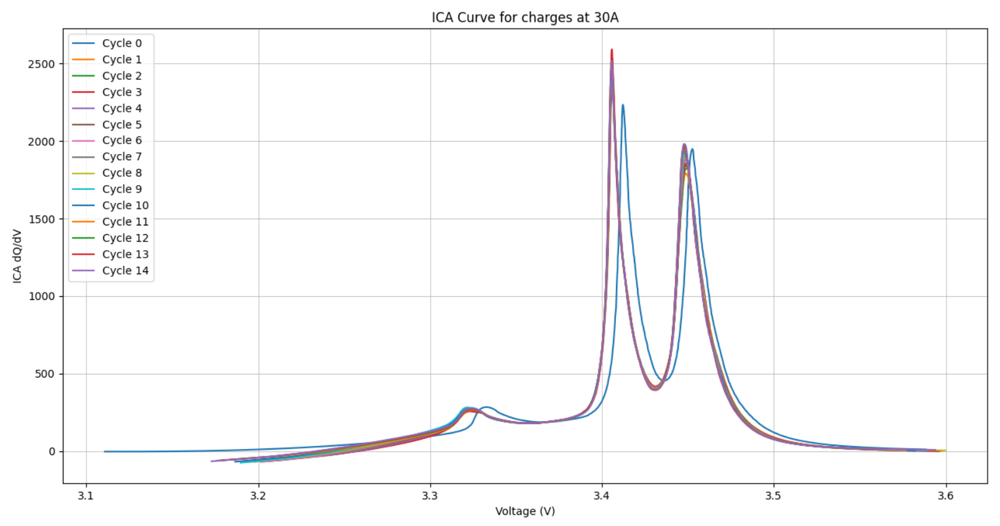

# README : BATCONNECT PROJECT
**Author :** Léa PITAULT

**Tutors :** COorinne Alonso, Élodie Chanthery, Pauline Ribot (LAAS-CNRS) & Jérémy Dulout (BATCONNECT Company)

**Internship starting date :** June 1st 2021

<hr>


## Table of contents :
1. [Project](#project)
2. [Data file format](#data_file_format)
3. [Files of the project](#files)
4. [Usage](#usage)
5. [To plot the ICA curves](#plot_ica_curves)
6. [Minimal main example](#mini_example)
7. [Example of result with ICA Curves](#ica_curve)

---

## Project : <a name="project"></a>
The goal of this projet is to study LiFePO4 batteries. The data are extracted from a testbench in the LAAS Laboratory or are given by the Batconnect company. The next section [Data file format](#data_file_format) presents the data format. 

The code allows to sort the data and plot several curves (such as ICA<sup>[1](#1)</sup>  VS Voltage)

Type of batteries : LF105 3.2V 105Ah

The data come from two different type of dataset : 

1. The LAAS Testbench, the batteries are cycled under controlled conditions and the data are collected in a file.txt 
2. The BATCONNECT data, given in a file.csv

<br>
<br>


[comment]: <> (FOOTNOTES)

<a name="1">1</a> : Incremental Capacity Analysis


---


## Data file format : <a name="data_file_format"></a>

* ### **LAAS Testbench File**

file.txt with 8 columns

*Example :*
| Sequence number | time (s) | cycle number | Voltage (V) | Current (mA) | Charge (m.Ah)  | Discharge (m.Ah) | Cell external temperature (°C) |
|:----:|:----:|:----:|:----:|:----:|:----:|:----:|:----:|
| 0  | 3.30  | 0 | 3.2196 | -4999.7 | 0 |  416.64 | 25.061 |

The sequence number depends on the testbench used. 
- A sequence can either corresponds to :
    - a CC charge, 
    - a CV charge, 
    - a discharge,
    - a rest.


* ### **BATCONNECT File**

csv.file with 23 columns

Not all the columns are useful. 
With the functions `readBatFile(file_title, line_begin, line_end)` you select only 10 columns and it stores the values of each in a dictionnary.

Finally you get those columns :

*Example :*

| ID | time (timestamp) | Status | Latitude (nmea) | Longitude (nmea) | voltage (V)  | Charge (SOC %) | Current (A) | Minimal temperature (°C) | Maximale temperature (°C)
|:----:|:----:|:----:|:----:|:----:|:----:|:----:|:----:|:----:|:----:|
| 862000000000000 | 1626723717 | 0 | 5034.897949 | 5034.897949 | 54.30 | 100.0 | 0.00 | 30.00 | 31.00


<br>

---

## Files of the project : <a name="files"></a>
<br>

The project is actually separated into two different packages. 
- One for the files used to process the Batconnect dataset.
- One for the files used to process the LAAS Testbench dataset.

<br>

- ### **BATCONNECT package** :  `dataset_bactonnect_pkg`

Acutally contains all the files and functions used to sort the Batconnect data. Some of the functions to plot curves are used from the testbench package.
    
<br>

- ### **TESTBENCH package** : `dataset_testbench_pkg` 

Contains all the files and functions used to sort the testbench data, filter them, make computation and plot data curves.

- ### **OUT OF THE PACKAGES** 

    - Main_dataMargot : main file using Margot dataset and LiNMC battery cell.
    - Main_dataLea : main file using Lea dataset and LiFePO4 battery cell.
    - Main_dataBatconnect : main file usinf Batconnect dataset and LiFePO4 battery cell.


<br>

---

## Usage : <a name="usage"></a>

<br>

### To plot the ICA curves : <a name="plot_ica_curves"></a>
 - F_plot.readFile(fileTitle) : you get the whole dataset as lists with the data of the 8 columns. You als get the number of cycle and sequence
 - F_plot.sortData(dic_dataSet) : you get a dictionary with the values in function of cycle or in function of sequences and charge or discharge
 - F_plot.plotICASeq(dic_dataSeq) : you plot the ICA curves after filtering

ICA curves are plotted using the **charge** values

---
### Minimal main example for LAAS Testbench : <a name="mini_example_testbench"></a>
```python
import Functions_PlotCurves as F_plot

file_title = '20210722_Cycle50A_LiFePO4_BATCONNECT_CA1.txt'

dic_dataSet, nbCycle, nbSeq = F_plot.readFile(file_title)
dic_dataCycle, dic_dataSeq = F_plot.sortData(dic_dataSet)
F_plot.plotICASeq(dic_dataSeq)
```

### Minimal main example for LAAS Testbench to plot voltage/time overlaid curves : <a name="mini_example_testbench_overlaid_voltage_curves"></a>
```python 

file_title2 = 'dataset_testbench_files/20210817_Cycle50A_12deg_LiFePO4_BATCONNECT_bat1_CA1.txt'

dic_dataSet1, nbCycle1, nbSeq1 = readFile(file_title2)

dic_dataCycle1, dic_dataSeq1 = sortData(dic_dataSet1)

title = 'Voltage of 15 cycles in function of time for Bat1 at 12°C (50A/30A)'

plotTestbenchOverlaidCurves(dic_dataCycle1, "t_cycle", "v_cycle", VOLTAGE_LABEL, CAPACITY_LABEL, title, 15)
```

```python
dic_dataSet1, nbCycle1, nbSeq1 = readFile(file_title1)
dic_dataSet2, nbCycle2, nbSeq2 = readFile(file_title2)

dic_dataCycle1, dic_dataSeq1 = sortData(dic_dataSet1)
dic_dataCycle2, dic_dataSeq2 = sortData(dic_dataSet2)
bat_data = 0
current_cycle = 10

##########
# plot a voltage/capacity curve for 12°C and 25°C on one figure
##########
voltage1 = dic_dataSeq1["V_c"][current_cycle]
capacity1 = dic_dataSeq1["Q_c"][current_cycle]
voltage2 = dic_dataSeq2["V_c"][current_cycle]
capacity2 = dic_dataSeq2["Q_c"][current_cycle]

plotCurve1yAxis(voltage1, capacity1, VOLTAGE_LABEL,
                CAPACITY_LABEL, 'green', bat_data, '25°C')
plotCurve1yAxis(voltage2, capacity2, VOLTAGE_LABEL,
                CAPACITY_LABEL, 'orange', bat_data, '12°C')


plt.title(
    'Capacity in function of voltage for one charge for two different temperatures')
plt.grid(linestyle='-', linewidth=0.5)
plotShow()
```

### Minimal main example for BATCONNECT data : <a name="mini_example_batconnect"></a>

```python
from dataset_batconnect_pkg.Functions_BatconnectSortData import *
from utilities_pkg import *
from dataset_batconnect_pkg.bat_constants import *
from dataset_batconnect_pkg import *
from dataset_testbench_pkg import *

file_title = 'Batconnect_files/batconnect_out_date.csv'

#Sort the data in a dictionnary of dictionnary : dict[id][measure]
dic_dataset_sort_id = read_sortBatFile(
    file_title, BAT_LINE_BEGIN, BAT_LINE_END)

#Get a list of all the different battery ID
IDs = getIDBatteriesFromDict(dic_dataset_sort_id)

current_id=IDs[1]

print("Current ID of the studied battery : ", current_id, " ; voltage: ", len(
    dic_dataset_sort_id[current_id]["voltage"]))

# Data of the axes of the first graph
x1 = dic_dataset_sort_id[current_id]["date"]
y1 = dic_dataset_sort_id[current_id]["voltage"]
title1 = 'Voltage of the total 16 cells for battery ID=8.62E+14 in function of time'

# Data of the axes of the second graph
x2 = dic_dataset_sort_id[current_id]["date"]
y2 = dic_dataset_sort_id[current_id]["charge"]
title2 = 'State of charge of battery ID=8.62E+14 in function of time'

#Plot two different graphs with the data
plotCurves(x1, x2, y1, y2, BAT_TIME_LABEL, BAT_VOLTAGE_LABEL,
          BAT_TIME_LABEL, BAT_CAPACITY_LABEL, title1, title2, '.')
```


<hr>

### Example of result with ICA Curves : <a name="ica_curve"></a>


